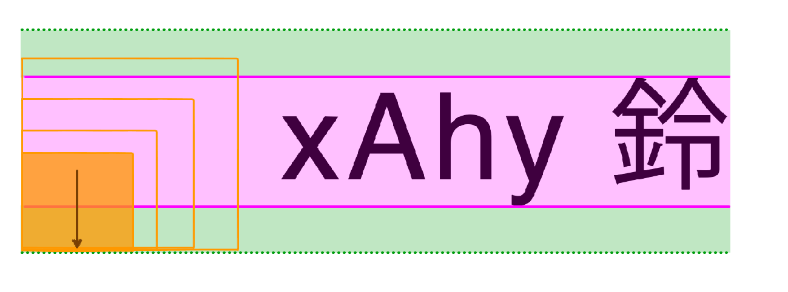
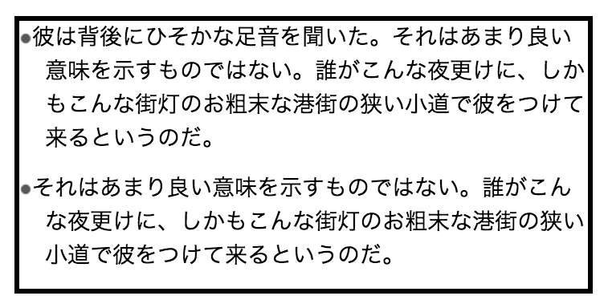

<h1 style="line-height:1.4;font-size:3em">Inline Layout</h1>

<p style="margin-bottom:0;padding-bottom:0">高津戸壮 <a href="https://twitter.com/Takazudo">@Takazudo</a></p>

----

# 自己紹介

<div style="display:table; width: 100%">
<div style="display:table-cell; vertical-align:middle; width:60%; vertical-align:top; padding:30px 0 0">
<ul>
<li>高津戸壮 (たかつど たけし)</li>
<li><a href="http://www.pxgrid.com/">株式会社ピクセルグリッド</a></li>
<li>フロントエンドエンジニア</li>
<li><a href="twitter.com/Takazudo">@Takazudo</a></li>
</ul>
</div>
<div style="display:table-cell; vertical-align:middle; width:40%"></div>
</div>

----

# 今日話すこと

<ul style="font-size:1.6em">
<li>font-size</li>
<li>line-height</li>
<li>vertical-align</li>
<li>inline-block</li>
</ul>

----

<pre style="font-size:2em"><code>&lt;div&gt;&lt;img&gt;&lt;/div&gt;
&lt;div&gt;&lt;img&gt;&lt;/div&gt;</code></pre>

---


---


---


---

<pre style="font-size:1.2em"><code>img { vertical-align: top; }</code></pre>

---


---

<p style="font-size:2em">このスペースって何？</p>

----


---

<p style="font-size:2em">うまく位置揃わない</p>

----

# 今日のメニュー

1. 画像下部の余白の謎
2. アイコン画像の縦位置調整
3. アイコンを飛び出させる
4. チェックボックスやラジオボタンの配置
5. リストのポッチ
6. カラムレイアウト

----

# 1. 画像下部の<br>余白の謎

----


```html
<p><span>The quick brown...</span></p>
```

```css
p {
  font-size: 16px;
  line-height: 16px;
}
span {
  background: pink;
}
```

---


---


```css
p {
  font-size: 16px;
  line-height: 24px;
}
```

---


---


---


```css
p {
  font-size: 16px;
  line-height: 24px;
}
```

----


---


---


----


```html
<p>The <b>quick</b> <em>brown</em> <i>fox</i> jumps...</p>
```

---


```html
<p>The <b>quick</b> <em>brown</em> <i>fox</i> jumps...</p>
```

```css
p  { font-size: 12px; line-height: 18px; }
b  { font-size: 20px; line-height: 30px; }
em { font-size: 30px; line-height: 40px; }
i  { font-size: 40px; line-height: 50px; }
```

---


```css
p  { font-size: 12px; line-height: 18px; }
b  { font-size: 20px; line-height: 30px; }
em { font-size: 30px; line-height: 40px; }
i  { font-size: 40px; line-height: 50px; }
```

----


```css
img.A { vertical-align: top; }
img.B { vertical-align: bottom; }
```

---


```css
img.C { vertical-align: text-top; }
img.D { vertical-align: text-bottom; }
```

---


```css
img.E { vertical-align: baseline; }
img.F { vertical-align: middle; }
```

---


```css
img.G { vertical-align: 5px; }
```

---


```css
img.H { vertical-align: central; }
```

----

#### vertical-align: top


---


----

#### vertical-align: bottom


---


----

#### vertical-align: text-top


---


---

#### +line-height: 1


※leading部分がなくなるから

----

#### vertical-align: text-bottom


---


----

#### vertical-align: baseline


---


----

#### vertical-align: middle


---


----

#### vertical-align: 10px


---


----

## ちょっとまとめ

`vertical-align`の値により色々スペースができる


----

# 2. アイコン画像の<br>縦位置調整

----


----


---

```html
<ul>
  <li> xAhy 鈴</li>
  <li> xAhy 鈴</li>
  <li> xAhy 鈴</li>
  <li> xAhy 鈴</li>
  <li> xAhy 鈴</li>
</ul>
```

----

#### vertical-align: top


---


----

#### vertical-align: bottom


---



----

#### vertical-align: text-top


---


----

#### vertical-align: text-bottom


---


----

#### vertical-align: baseline


---


----

#### vertical-align: 4px


---


---

#### vertical-align: -4px


----

#### vertical-align: middle


---


---


```css
img {
  vertical-align: middle;
}
```

----

#### 微調整の例


---


```css
img {
  vertical-align: middle;
  position: relative;
  top: -0.1em;
}
```

----

## ちょっとまとめ

* とりあえず`middle`ベースがいいんじゃない？
* アイコンのサイズとか決めちゃうと楽


----


----

# 3. アイコンを<br>飛び出させる

----


```html
<ul>
  <li>彼は背後に...</li>
  <li>それはあまり...</li>
</ul>
```

----


```css
ul {
  border: 3px solid #000;
  list-style-type: none;
}
li {
  padding: 0 0 10px 32px;
}
img {
  width: 24px;
  height: 24px;
  vertical-align: middle;
}
```

----


```css
ul {
  border: 3px solid #000;
  list-style-type: none;
}
li {
  padding: 0 0 10px 32px;
  text-indent: -32px; /* 1行目だけ左に32pxずらす */
}
img {
  width: 24px;
  height: 24px;
  vertical-align: middle;
}
```

---


----


```css
ul {
  border: 3px solid #000;
  list-style-type: none;
}
li {
  padding: 0 0 10px 32px;
  text-indent: -32px;
}
img {
  width: 24px;
  height: 24px;
  vertical-align: middle;
  margin: -14px 8px -10px 0; /* 32px確保 + 上下の高さ殺し */
}
```

---


```
margin-top: -14px;
margin-bottom: -10px;
```

----

## ちょっとまとめ

`text-indent`で戻した部分に  
アイコンを置くと便利そう

----

# 4. チェックボックス<br>やラジオボタンの配置

----


```html
<ul>
  <li><label><span><input type="radio"></span>彼は...</label></li>
  <li><label><span><input type="checkbox"></span>それは...</label></li>
</ul>
```

----


```css
ul {
  list-style-type: none;
  border: 3px solid #000;
}
li {
  padding: 0 0 10px 25px;
}
```

----


```css
ul {
  list-style-type: none;
  border: 3px solid #000;
}
li {
  padding: 0 0 10px 25px;
  text-indent: -25px;
}
```

----


```css
span {
  display: inline-block;
  width: 20px;
  margin: -17px 5px -13px 0;
  vertical-align: middle;
  background: red;
}
input {
  display: block;
  margin: 0 auto;
}
```

---


----

## インラインブロック

* `display: inline-block`
* 外からは``のようなインライン<br>置換要素のようにレイアウトされる
* 中にブロックレベルの要素を入れられる
* なかなか柔軟に使えるので色々活躍

----

# 5. リストのポッチ

----


```html
<ul>
  <li>彼は背後に...</li>
  <li>それはあまり...</li>
</ul>
```

```css
li {
  padding: 0 0 10px 16px;
  background: url(bullet.png) no-repeat 0 .45em;
}
```

----


---


----


```css
li {
  padding: 0 0 10px 16px;
}
li:before {
  content: '';
  width: 8px;
  height: 8px;
  display: inline-block;
  background: url(bullet.png) no-repeat 0 0;
  vertical-align: middle;
}
```

----



```css
li {
  padding: 0 0 10px 16px;
  text-indent: -16px; /* 左へ */
}
li:before {
  content: '';
  width: 8px;
  height: 8px;
  display: inline-block;
  background: url(bullet.png) no-repeat 0 0;
  vertical-align: middle;
}
```

----


```css
li {
  padding: 0 0 10px 16px;
  text-indent: -16px;
}
li:before {
  content: '';
  width: 8px;
  height: 8px;
  display: inline-block;
  background: url(bullet.png) no-repeat 0 0;
  vertical-align: middle;
  margin: -5px 8px -3px 0; /* マージン調整 */
}
```

----


---


----


----

## ちょっとまとめ

色々細かいレイアウト制御に便利

----

# 6. カラムレイアウト

----


```html
<div>Hello! Hello! Hello!</div>
```

----


```css
.box {
  display: inlie-block;
  vertical-align: middle;
}
```

```html
<div>
  Hello! 
  <div class="box">...</div>
  Hello!
</div>
```

----


```html
<div>
  Hello! 
  <div class="box">...</div>
  <div class="box">...</div>
  Hello!
</div>
```

----


```html
<div>
  <div class="box">...</div>
  <div class="box">...</div>
  <div class="box">...</div>
</div>
```

----


----

# まとめ

----

* インラインレイアウトの仕組みを知れば<br>いろいろ悩むところ減って捗る
* 細かいところにも大きなところにも使えて<br>いろいろ応用が効くヤツ
* IE8〜なら概ね問題なく使えるので<br>じゃんじゃん使ってるね既に

----


----


---

* [CSS再入門 - inline layout 1](https://app.codegrid.net/entry/inline-layout-1)


----

# ありがとう<br>ございました
